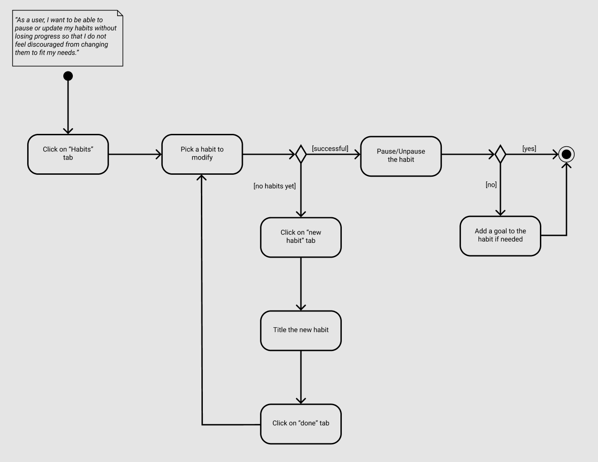
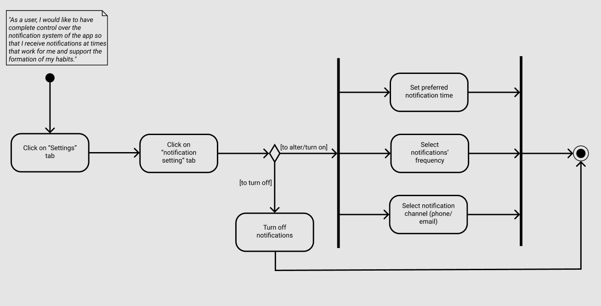

# Specification Phase Exercise

A little exercise to get started with the specification phase of the software development lifecycle. See the [instructions](instructions.md) for more detail.

## **HabitMinder** - Habit Tracker & Reminder App

**HabitMinder** is the Habit Tracker & Reminder app. It is a simple, privacy-focused tool designed for busy individuals, students, and self-improvement enthusiasts. It enables users to quickly create and manage habits, receive timely local notifications, and track progress through visual cues like streaks and calendar views. Optional social accountability features allow friends to share in the journey—all while keeping data stored locally to ensure a frictionless, secure experience.

## Team members

* [Gilad Spitzer](https://github.com/giladspitzer)

* [Peng Jiang](https://github.com/PengJiang-Victor)

* [Polina Belova](https://github.com/polinapianina)

* [Jahleel Townsend](https://github.com/JahleelT)

## Stakeholders

### Stakeholder 1

**Name:** Jamie K.  
**Profile:** A 27-year-old marketing professional who is committed to self-improvement but struggles to maintain consistent habits due to a hectic schedule.

**Interview Summary:**  
Jamie finds it challenging to remember daily healthy practices (e.g., staying hydrated, exercising, practicing mindfulness) amidst work and personal commitments. While Jamie has experimented with various habit-tracking apps, they found that many are either overly complex or require cumbersome account setups. Jamie expressed a desire for an app that is quick to use, visually motivating, and adaptable to life’s interruptions.

**Goals/Needs:**
- **Quick Habit Creation:** Easily add new habits with minimal steps.
- **Timely Reminders:** Receive local notifications that prompt habit completion at the right time.
- **Visual Progress Tracking:** Monitor daily and weekly progress via streak counts, calendars, or simple graphs.
- **Flexible Management:** Ability to pause or adjust habits without losing progress or feeling discouraged.
- **Optional Social Accountability:** Share selected habit progress with friends to boost motivation.

**Problems/Frustrations:**
- **Forgetfulness:** Regularly misses daily habits due to a busy schedule.
- **Overly Complex Interfaces:** Current apps have too many features, making it difficult to quickly log or view progress.
- **Lack of Immediate Feedback:** Insufficient visual cues (like streaks or progress graphs) to motivate continuous improvement.
- **Inflexibility with Life Events:** Existing apps don’t allow for easy pausing of habits during exceptional circumstances (e.g., travel, illness), which can disrupt motivation.

### Stakeholder 2

**Name:** Alex M.  
**Profile:** A 20-year-old college student juggling academic responsibilities, a part-time job, and a busy social life. Alex is eager to establish a balanced routine that includes studying, exercise, and self-care, but finds it difficult to integrate habit tracking into an already overloaded schedule.

**Interview Summary:**  
Alex expressed that while multiple digital tools help manage academic schedules and assignments, none effectively address personal habit tracking. Alex needs a dedicated, streamlined tool that complements a busy lifestyle without adding complexity. A user-friendly interface with quick logging, flexible scheduling adjustments, and visually appealing progress tracking would make a significant difference. Additionally, the ability to pause habits during periods of high academic pressure or unexpected events was highlighted as essential.

**Goals/Needs:**
- **Integrated Scheduling:** Seamlessly manage and integrate personal habits alongside academic and work schedules.
- **Simplified Logging:** Quickly log habit progress without navigating through multiple screens or settings.
- **Motivation Through Visual Feedback:** Use streaks, calendars, or simple graphs to monitor progress and stay motivated.
- **Flexibility:** Easily adjust or pause habits during exam periods, project deadlines, or personal events.
- **User-Friendly Interface:** An intuitive design that minimizes distractions and streamlines the habit tracking process.

**Problems/Frustrations:**
- **Digital Overload:** Too many apps already clutter Alex’s digital life; adding a complex habit tracker is not appealing.
- **Rigid Scheduling:** Existing habit trackers often do not offer enough flexibility to accommodate a fluctuating college schedule.
- **Poor User Experience:** Cluttered interfaces and excessive features in current apps make habit logging a chore rather than a help.
- **Inconvenient Reminders:** Notifications that come at inopportune times or are easily missed disrupt rather than support daily routines.

## Product Vision Statement

**HabitMinder** is a simple, privacy-focused Habit Tracker & Reminder app that empowers busy individuals to effortlessly build and maintain positive routines through intuitive habit creation, timely local notifications, and visual progress tracking.

## User Requirements

### User Stories:
1. As a user, I want to be able to easily add a new habit with minimal steps so that I can easily track my habits.
2. As a user, I want to receive notifications related to my habit so that I can have an easier time adhering to the habit.
3. As a user, I want to be able to see my habit progress in a visually pleasing format so that I can remain motivated in forming/maintaining the habit.
4. As a user, I want to be able to pause or update my habits without losing progress so that I do not feel discouraged from changing them to fit my needs.
5. As a user, I want to be able to share my progress with selected habits amongst friends so that I can increase my motivation.
6. As a user, I want a simple and natural-feeling interface so that I can use the app with ease/without being overwhelmed.
7. As a user, I would like to be able to categorize my habits by category (academic, work, personal, interpersonal, etc), so that I can keep my habits neatly organized.
8. As a user, I would like to easily navigate between habits so that I do not waste time clicking through screens.
9. As a user, I would like to have complete control over the notification system of the app so that I receive notifications at times that work for me and support the formation of my habits.
10. As a user, I would like to have a mascot (akin to a tamagotchi or Duo from Duolingo), so that I have a stronger desire to check-in and maintain my habits.
11. As a user, I do not want my experience to be full of gimmicky elements so that I do not find the experience overwhelming.

## Activity Diagrams

“As a user, I want to be able to pause or update my habits without losing progress so that I do not feel discouraged from changing them to fit my needs.”

"As a user, I would like to have complete control over the notification system of the app so that I receive notifications at times that work for me and support the formation of my habits."

## Wireframes

[The link to wireframes](https://www.figma.com/design/0GcCOLqIAPqkRZBj46tfAY/Team-Awesome?node-id=0-1&p=f&t=p2dBjltyaslNkA2Y-0)

## Clickable Prototype

[The link to prototype in figma (newest version)](https://www.figma.com/proto/0GcCOLqIAPqkRZBj46tfAY/Team-Awesome?node-id=63-299&p=f&t=p2dBjltyaslNkA2Y-0&scaling=scale-down&content-scaling=fixed&page-id=0%3A1&starting-point-node-id=63%3A299&show-proto-sidebar=1)
